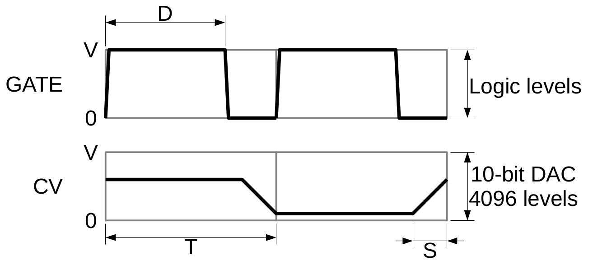
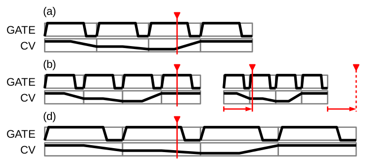

## Timing and Intervals

### Overview
{width="640"}

The diagram illustrates the signal levels for the CV and GATE outputs for a two note sequence. 
* Interval $T = \frac{60}{BPM}$. The speed ranges from 24 to 240 BPM. Therefore $T_{min} = 0.25s$ and $T_{max} = 2.5s$
* Duty cycle $D$ ranges from 0 to 1
* Slide $S$ ranges from 0 to 1
  * This could refer to (inverse) slope instead of slide: 1/m = 0 is an abrupt transition; 1/m = 1 is the slowest constant slope (maybe 0.1V/T).
  * Could be linear or quadratic ("swoop" up/down)
* The GATE output is a logic-level output from the SAMD21, buffered/amplified to 0-5V output
* The CV output is an analog output from the SAMD21 DAC, buffered/amplified to 0-5V output
  * The DAC is 10-bit/4096 levels with a minimum conversion time of less than 3us (max 350ksps)

### Discretization
The target is <1ms resolution. The interval can be set by the ADC conversion time in free-running mode. In each interval
* sample the current level control (potentiometer)
  * ADC conversion complete
* sample the current button state (logic 0 or 1)
  * set next action if debounced
* trigger a DAC conversion with the active CV level
* write the GATE output bit
* advance the MUX address to the next inputs
* update interval counter
* calculate the next state
  * accumulate and average the level inputs ($T_{lag} = N_{avg}*8ms$) -- neccessary in addition to ADC averaging?
  * compute the next CV level (apply quantization & slide with updated levels)
  * compute the next GATE bit (duty cycle)
* did we start a new interval? button triggered or timeout
  * update lights -- 128 bytes @ 800kHz = 0.16ms, DMA compatible
  * update display -- **1024 bytes @ 400kHz = 2.56ms** (@ 800kHz = 1.28us)
* check the state of the rotary control & push button
  * menu action?

### Modes and Timing
Changes to the settings will impact the current and future state of the outputs. The following table summarizes those effects.

| Control input | Interval change? | Effect    | Update | Notes |  
|---------------|------------------|-----------|--------|-------|
| Slide         | No               | immediate | CV     | recalculate slope & intercept |
| Duty          | No               | immediate | GATE   |       |
| Quantization  | No               | next interval | CV     | apply quantization |
| Active        | No               | immediate | GATE   | |
| Piano         | No               | next interval | CV, GATE, interval ID| time quantized |
| BPM           | Yes              | immediate | all | see sketch |
| No. intervals | No               | next interval | all | if n > N, n=0 |

TODO: the following is dumb. Just keep the cursor in the same interval, same relative position.

~~In the diagram below, the impact of adjustments to the BPM are illustrated. The sequencer has a timing resolution $\Delta t$, such that each interval is composed of $N_i = \left\lfloor\frac{60}{BPM \times \Delta t}\right\rfloor = \left\lfloor\frac{60 f_{tick}}{BPM}\right\rfloor$ time steps. The index of the current time step is then $n = k_i N_i + m$, where $k_i$ is the interval index and $m$ is the time step index within the interval.~~
* hold $n$ constant, BPM adjustment changes $N_i$
* $k_i = n / N_i$
* $m = n - k_i N_i$
* $k_i = \mathrm{mod}(k_i,N)$ where $N$ is the number of intervals

